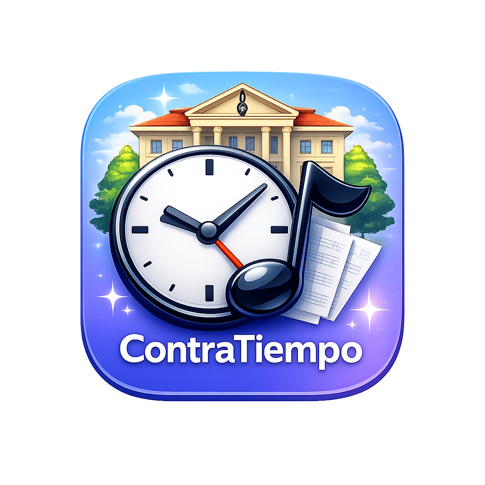

<p align="center">
  
</p>

<h1 align="center">ContraTiempo</h1>

<p align="center">
  Gestor de horarios para conservatorios de musica
</p>

<p align="center">
  <a href="https://jlmirallesb.github.io/ContraTiempo/">Abrir la app</a> ·
  <a href="https://ko-fi.com/miralles">Invitar a una horchata</a>
</p>

---

## Que es ContraTiempo

ContraTiempo es una herramienta para planificar horarios de conservatorio. Permite ubicar franjas horarias de asignaturas impartidas por docentes en aulas, con deteccion automatica de conflictos, contadores de horas y exportacion a Excel.

**Funciona directamente en el navegador**, sin necesidad de instalar nada ni crear cuentas. Todos los datos se guardan en tu navegador (localStorage) y puedes exportarlos a Excel o JSON en cualquier momento.

## Funcionalidades

- Cuadricula de horario con dos modos de vista (por dia o por aula) y granularidad 30 min / 1 hora
- Drag & drop para mover franjas entre celdas
- Gestion de aulas (con sedes, pisos, atributos), docentes, asignaturas y ocupaciones
- Vistas individuales por aula, docente o asignatura
- Deteccion de conflictos (aula ocupada, docente en dos sitios)
- Contador de horas por docente (clases, ocupaciones, diferencia con contrato)
- Calculador de capacidad de alumnado por asignatura
- Buscador de huecos libres (aula + docente)
- Multiples escenarios de horario con comparador de diferencias
- Import/export Excel (individual por entidad, escenario, o backup completo)
- Sincronizacion JSON para integracion con MCP Server
- PWA instalable desde el navegador

## Uso rapido

**Opcion 1: Usar online (recomendado)**

Abre https://jlmirallesb.github.io/ContraTiempo/ en tu navegador. Puedes instalarla como app desde Chrome (icono de instalar en la barra de direcciones).

**Opcion 2: Ejecutar en local**

```bash
git clone https://github.com/JLMirallesB/ContraTiempo.git
cd ContraTiempo
npm install
npm run dev
```

Abre http://localhost:5173/ContraTiempo/ en tu navegador.

Requisito: [Node.js](https://nodejs.org/) v18 o superior.

**Opcion 3: App de escritorio (Tauri)**

```bash
npm install
npm run dev          # En una terminal
npm run tauri:dev    # En otra terminal
```

Requisito adicional: [Rust](https://rustup.rs/) instalado.

Para generar el instalador (.dmg en macOS):

```bash
npm run tauri:build
```

## MCP Server

ContraTiempo incluye un servidor MCP que permite a Claude (u otros asistentes IA) leer y escribir datos del horario mediante herramientas.

### Instalacion

```bash
cd mcp-server
npm install
npm run build
```

### Configuracion en Claude Desktop

Añade esto a tu `claude_desktop_config.json`:

```json
{
  "mcpServers": {
    "contratiempo": {
      "command": "node",
      "args": ["/ruta/a/ContraTiempo/mcp-server/build/mcp-server/src/index.js"]
    }
  }
}
```

### Herramientas disponibles (30)

**Datos maestros (16):** crear, listar, actualizar y eliminar aulas, docentes, asignaturas y tipos de ocupacion.

**Escenarios y franjas (9):** gestionar escenarios de horario, crear y eliminar franjas de clase u ocupacion.

**Consultas (5):** ver horario de un docente o aula, validar conflictos, buscar huecos libres, resumen de horas.

Los datos se comparten con la app mediante el archivo `~/.contratiempo/data.json`.

## Estructura del proyecto

```
ContraTiempo/
├── shared/           # Tipos y utilidades compartidos (app + MCP)
├── src/              # App React (Vite + Tailwind + Zustand)
├── src-tauri/        # Wrapper Tauri (app escritorio)
├── mcp-server/       # MCP Server (30 tools)
├── public/           # Assets estaticos + PWA manifest + service worker
└── docs/             # Documentacion de arquitectura
```

Para mas detalles, consulta:
- [CLAUDE.md](CLAUDE.md) — referencia tecnica completa
- [docs/ARCHITECTURE.md](docs/ARCHITECTURE.md) — arquitectura y decisiones de diseno

## Stack

React 19 · TypeScript · Vite 8 · Zustand · Tailwind CSS 4 · @dnd-kit · SheetJS · Tauri v2 · MCP SDK

## Creditos

- Diseno: **JLMiralles**
- Programacion: **Claude Opus**

## Licencia

Este proyecto es de codigo abierto. Consulta el archivo LICENSE para mas detalles.
